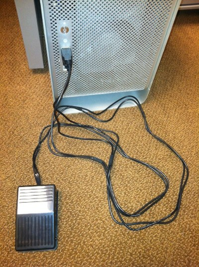

# VIM的操作

## VIM三种工作模式的切换

VIM总共有三种工作模式:命令模式、编辑(插入)模式、末行模式

## 命令模式

一进入vim默认的就是命令模式，在该模式下输入的指令都是直接的操作。


```
hjkl是上下左右
ZZ 保存并退出(shift +zz)

yy 赋值当前行
p  粘贴
dd 剪切当前行  n dd 剪切n行 ---删除

gg 回到文件开头
G  到文件末尾

```


## 末行模式
从命令模式进入末行模式使用 : (shift + ;)
w 保存 write
q 退出 quit
wq 保存并退出
! 强制;暂先执行一条指令然后回到VIM界面
q! 不保存并退出
注意  如果对文件本身没有写权限那么及时加上！强制写入也是徒劳的。

> !gcc test.c
可以在编辑某个源文件的同时 编译当前文件


从末行模式回到命令模式按ESC

## 编辑模式
```
插入、替换
从命令模式到**插入模式**有很多快捷键
o 当前行的下一行开一行
O 当前行的上一行开一行
i 插入在光标前
I 插入在行首
a 插入在光标后
A 插入在行末
```


从编辑模式回到命令模式按Esc键

## VIM的ESC键
从上面可以看到三个状态之间的装换 高频的需要使用Esc键，ctrl+\[ 
 	Ctrl+\[ 和 ESC具有完全相同的ASCII码值（0x1b)，所以这两个键完全一样


## VIM拓展

Aleksandr Levchuk 这位老兄可以称得上是 [Vim](http://www.vim.org/) 文本编辑器的超级粉丝。有意思的是，他为了改善 Vim 的文本编辑速度，竟亲自动手为 Vim 制作了脚踏板离合器。当踩下踏板时，就会让 Vim 进入插入模式（效果如按 i 一样）；如果松开踏板，则会回到 Vim 的正常模式（就像按了 ESC 键）。



作者将 [Vim Clutch](https://github.com/alevchuk/vim-clutch) 的制作过程放在了 GitHub 上，有兴趣的朋友不妨参考。

关于VIM的上下左右键


# HTML简单介绍

## 最简单的HTML格式

HTML5标准语法

```
<html>
 <head></head>
 <title></title>
 <body>
  
 </body>
</html>
```